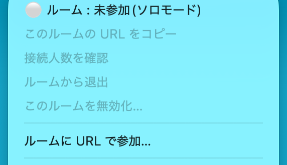
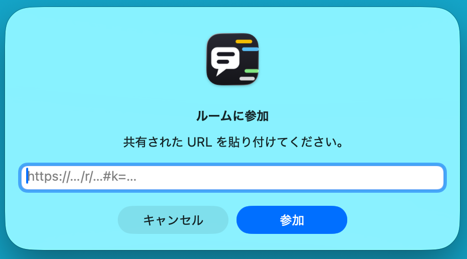
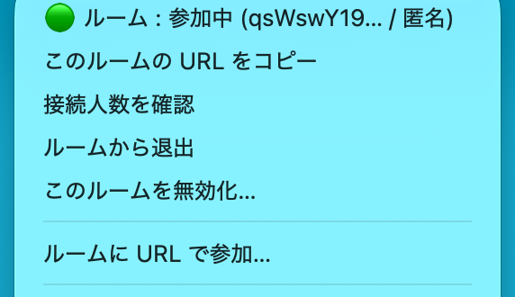
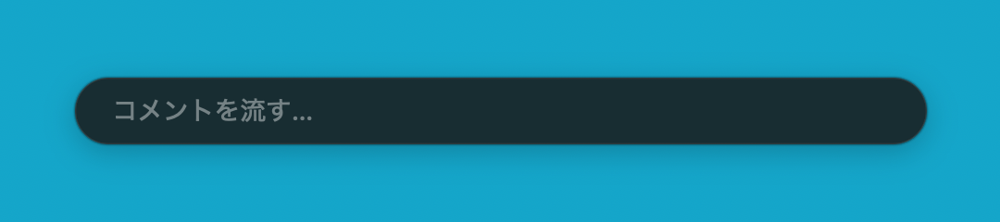
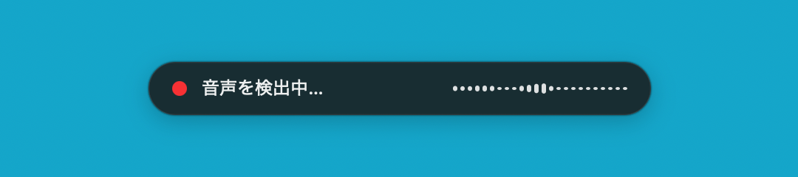

<div align="center">

# gaya-talk

モニターの上でコミュニケーション

[](https://github.com/mykstmhr/gaya-talk/releases/latest)
[](https://github.com/mykstmhr/gaya-talk/actions/workflows/ci.yml)

[](LICENSE)

[ホストガイド](docs/hosting.md) · [開発者ガイド](docs/development.md)

</div>

## 特徴

- **コメントやリアクションを画面に流せる** — 送信した文字がその場でコメントになり、同じルームのメンバー全員のモニターを流れる。デフォルトではコメントは画面共有に映らないため、会議そのものを邪魔しない(設定で変更可)
- **起動していればいつでも、簡単に** — メニューバー常駐なので会議中に限らない。`右⌘` で入力バーを出して Enter で送信するだけ
- **暗号化されていて安全** — 本文は E2E 暗号化(鍵は共有 URL の `#` 以降に載り、サーバへは渡らない)。中継サーバは本文を読めず、記録も残さない
- **音声入力でもコメントできる** — 設定すれば話した言葉が自動で文字起こしされて流れる。whisper.cpp・Ollama によるローカル処理で音声は外部に出ない(スピーカー出力中は自動オフ)

## インストール

ターミナルで 1 コマンド(認証不要。**アップデートも同じコマンド**):

```sh
d="$(mktemp -d)" && curl -fL -o "$d/gaya-talk.app.zip" \
    https://github.com/mykstmhr/gaya-talk/releases/latest/download/gaya-talk.app.zip \
  && { pkill -x gaya-talk 2>/dev/null; sleep 1; rm -rf /Applications/gaya-talk.app; } \
  && ditto -x -k "$d/gaya-talk.app.zip" /Applications \
  && open /Applications/gaya-talk.app
```

- ブラウザで zip を落とした場合は、.app を**「アプリケーション」へ移動してから**右クリック→「開く」(そのまま開くとホットキーが効かない)
- バージョンはメニュー下部に表示される。リリース版は「**アップデートを確認…**」からそのまま更新できる
- 自分でビルドするなら `brew install go && make setup && make app-open`

## 使い方

1. 初回に**アクセシビリティ権限**を許可する(声も使うなら**マイク**も)
2. メニューバーのアイコン →「**ルームに URL で参加…**」に招待 URL を貼る(再起動・アップデート後は前回のルームに自動で入り直す)

   

   

   参加できるとメニュー先頭が 🟢「ルーム : 参加中」に変わる:

   

3. **`右⌘`** で入力バー → 打って **Enter** で流す(バーは開いたまま連投できる。閉じるのは Esc か再度 `右⌘`)

   

4. 声も使うなら clone して `make setup-voice`(whisper / Ollama の導入 + モデル取得 + config 反映)。**`右⇧+右⌘`** でリッスン開始/停止、無音の切れ目で自動区切りして流れる

   

覚えておくこと:

- 匿名ルームは色で同一人物を追える。記名ルームは各コメントに `[表示名]` が付く
- 流れているコメントは **`⌥(Option)` を押しながらクリック**で本文をコピーできる(一瞬明滅したらコピー成功)
- `voice.input` は既定 `auto`: **イヤホン出力ならオン、スピーカーなら自動オフ**(相手の声を拾わないため)
- 「**🔴Slack記録対象**」と出るルームはコメントが Slack にも残る
- キー変更・効果音・整形などは「設定ファイルを開く…」で編集(**各項目の説明は config 内のコメントが正**。反映は「再起動」)

## 困ったとき

| 症状 | 対処 |
|---|---|
| ホットキーが効かない | .app を「アプリケーション」へ移動して開き直す。アクセシビリティ権限を確認(旧ビルドの許可が残っていたら一度削除して付け直す) |
| 声が入らない | スピーカー出力中は自動オフ。イヤホンにするか `voice.input: "on"` |
| 認識が悪い・小声を拾わない | `gain.max_gain` を 12→20。`GAYATALK_DEBUG=1 gaya-talk dryrun` で `rms=` を見て `vad.threshold` を調整 |
| 「⛔ 無効化または期限切れ」 | そのルームは閉鎖済みか 7 日未使用で失効。ホストに新しい URL をもらう |
| Bluetooth イヤホンの再生音が途切れる | `gaya-talk devices` で内蔵マイク名を調べ、`voice.device` に指定して録音だけ内蔵マイクに固定 |

CLI(`gaya-talk devices` / `keys` / `dryrun`)のパスは `/Applications/gaya-talk.app/Contents/MacOS/gaya-talk`(clone してビルドしたなら `./bin/gaya-talk`)。ログは `~/Library/Logs/gaya-talk.log`(`make logs` で追尾)。

## アンインストール

clone 済みなら `make uninstall`(確認プロンプト付き)。手動なら:

```sh
pkill -x gaya-talk 2>/dev/null; sleep 1
rm -rf /Applications/gaya-talk.app ~/.config/gaya-talk ~/Library/"Application Support"/gaya-talk
rm -f ~/Library/Logs/gaya-talk.log
tccutil reset Accessibility com.mykstmhr.gayatalk
tccutil reset Microphone com.mykstmhr.gayatalk
```

- 自分が作ったルームは**先に「このルームを無効化…」で閉鎖**しておく(管理シークレットが消えると二度と無効化できない)
- Ollama のモデルと brew パッケージは他アプリと共有の可能性があるため消さない。消すなら `ollama rm qwen2.5:3b` / `brew uninstall whisper-cpp ollama`
