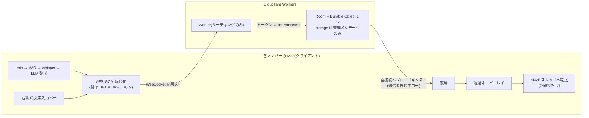
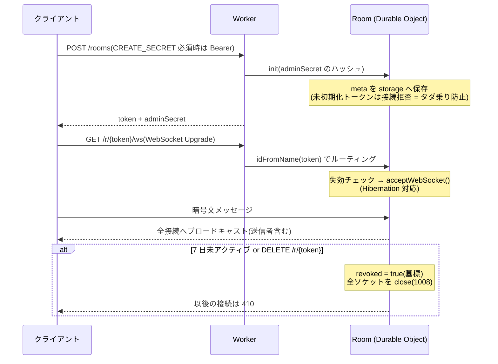

# 開発者向け

## ビルドと実行

```sh
make            # ターゲット一覧(help)
make app-open   # .app をビルドして起動(実挙動の確認はこれ)
make build      # bin/gaya-talk のみ
make restart    # 起動中の .app を停止して開き直す(再ビルドなし)
make logs       # ~/Library/Logs/gaya-talk.log を追尾
make dist       # 配布用 zip(dist/gaya-talk.app.zip)
```

Go 1.26.4+。ホットキーの権限は署名済み `.app` に紐づくため、動作確認は `go run .` ではなく `make app-open` を使う(`go run . dryrun / devices / overlay-demo / keys / version` は補助用)。設定は `~/.config/gaya-talk/config.json`(初回起動時に雛形を自動生成)。発話本文は既定でログに残さず、`GAYATALK_DEBUG=1` のときだけ出す。

## ドキュメント用スクリーンショット

全ウィンドウは既定で `sharingType=None` のため、画面共有だけでなくスクリーンショット・収録にも映らない。README 等の画像を撮るときは `GAYATALK_CAPTURE=1` で起動すると、オーバーレイ・入力バー・音声バーがすべて映る(メニューの「画面共有にコメントを映す」も最初からオン)。環境変数は `open` 経由では渡らないので、バンドル内のバイナリを直接起動する:

```sh
make app
GAYATALK_CAPTURE=1 build/gaya-talk.app/Contents/MacOS/gaya-talk
```

撮り終えたらメニューから終了し、普段どおり起動し直せば既定(映らない)に戻る。

## テスト

```sh
go test ./internal/...
cd server && npm test && npm run typecheck
GAYATALK_E2E_SERVER=https://<your>.workers.dev go test ./internal/room -run E2E   # 実サーバ疎通(任意)
```

## リリースと署名

```sh
make release VERSION=patch   # minor / major / v1.2.3 も可。タグ push → CI が zip を Release に添付
```

- 署名は自己署名証明書 **`gaya-talk-dist`**(secrets `MACOS_SIGN_P12` / `MACOS_SIGN_P12_PASSWORD`)。**毎リリース同じ身元にすることで、利用者が付与した権限が更新後も失効しない**。secrets 未設定ならアドホック署名にフォールバック(その場合は更新のたびに権限再付与)
- TCC の許可は**バンドル ID + 署名**に紐づく。ローカルビルドも同じ身元にするため、キーチェーンに `gaya-talk-dist` を入れておく(`make app` が dist → dev → アドホックの順で自動選択)。署名の違うビルドを行き来すると「トグルは ON なのに効かない」状態になる(システム設定で許可を一度削除して付け直す)
- quarantine 付きのまま開くと App Translocation でホットキーが効かない(アプリが検知して警告を出す)。「アプリケーション」へ移動 → 右クリック→「開く」
- 不特定多数に配るなら Developer ID + notarization が必要(未対応。社内・小チーム想定)

## アーキテクチャ



- 文字起こし・整形はローカル、本文はクライアントで暗号化。**鍵は URL のフラグメント(`#k=…`)にだけ載り、サーバには暗号文しか渡らない**(E2E)
- サーバは本文を保存しない。復号もしない「中継するだけ」の存在
- 自分のコメントもサーバのエコー経由で表示するため全員同じ順序。ID で重複排除

### なぜ Durable Object か

Durable Object(DO)とは、Cloudflare Workers の機能の一つで、**ID ごとに世界で 1 つだけ起動する、永続ストレージ付きのステートフルなインスタンス**のこと。この「1 ルーム = DO 1 インスタンス」という対応が、このアプリの要件とちょうど噛み合っている:

- **ルームの全接続が 1 か所に集まる。** 通常の Worker はリクエストごとに別インスタンスで動くためステートレスな処理しかできず、「同じルームの接続一覧」を持てない。DO は同じ名前(ルームトークン)に対して**世界で 1 インスタンス**だけが起動することが保証されるので、`idFromName(token)` でルーティングするだけで全参加者のソケットが同居し、`getWebSockets()` を回すだけでブロードキャストできる。Pub/Sub 基盤や Redis を別途立てる必要がない
- **順序が自然に一意になる。** 単一インスタンスがメッセージを直列に処理するため、全員が同じ順序でコメントを受け取る。「自分の発言もエコーで表示」できるのはこの性質のおかげ
- **WebSocket Hibernation で「繋ぎっぱなし」が無料になる。** `acceptWebSocket()`(Hibernation API)を使うと、アイドル時に DO 本体をメモリから退避しつつ接続だけ Cloudflare 側が維持してくれる。会議アプリは「接続時間は長いが発言は疎」なので、これが無いと接続時間(duration)課金で無料枠に収まらない。レートリミット状態をソケットの attachment に持たせているのも、退避 → 復帰をまたいで残すため
- **ストレージが付属していて、失効を遅延評価で済ませられる。** DO storage に `lastActive` を持ち、接続・発言のタイミングで「7 日超過なら失効」を判定する。ルームごとに閉じた状態なので cron などの定期ジョブが要らない。失効・無効化は削除ではなく**墓標(revoked)**として残す — `deleteAll` で消すと次の接続で DO がまっさらに再生成され、URL が復活してしまうため

ルームのライフサイクル:



### 無料枠のコスト

- コストは実質「**コメント数 × 参加人数**」の DO リクエスト数(無料枠 10万/日)。5 人で 1 時間 200 コメントでも約 1,000
- Hibernation により、繋ぎっぱなしでも発言していない間は課金対象がほぼ 0
- ブロードキャストが O(接続数) なので、1 ルームの同時接続は 32 に制限(課金増幅の防止)。メッセージも 16KB 上限 + 接続ごとに 10 秒 30 通のレートリミット

## 構成

```
main.go                          サブコマンド・メニューバー常駐・PTT/VAD ループ
selfupdate.go                    バージョン表示とリリース版の自己アップデート(gh 経由)
room_ui.go                       ルームのメニュー配線・送受信・自動再参加
internal/config/                 設定の読み込み(JSONC・旧スキーマ互換)
internal/recorder/               マイク録音(malgo)
internal/vad/                    無音で発話単位に区切る
internal/transcribe/             whisper-cli 呼び出し(ローカル STT)
internal/enhance/                Ollama 整形・絵文字付与(任意)
internal/room/                   共有 URL・E2E 暗号(AES-GCM)・再接続 WS クライアント
internal/roomstore/              最後に参加したルームの永続化(自動再参加)
internal/overlay/                ライブコメントオーバーレイ(透過・クリック貫通・画面共有に映らない)
internal/inputbar/               Spotlight 風の文字入力バー
internal/voicebar/               リッスン中の状態バー(音量メーター)
internal/trayicon/               メニューバーアイコン(build/genicons.swift で生成)
internal/dialog/                 モーダルダイアログ
internal/audioout/               出力デバイス判定・監視(voice.input:auto 用)
internal/voicegate/              音声入力可否の状態集約
internal/namestore/              表示名の永続化
internal/adminstore/             ルーム管理シークレットの永続化
internal/mirror/ + slack/        Slack ミラー(状態機械と投稿クライアント)
internal/modkey/                 単体修飾キーの検出(CGEventTap)
server/                          中継サーバ(Cloudflare Workers + Durable Objects)
```

## 設定

**各キーの説明と既定値は [config.example.json](../config.example.json) のコメントが正**。JSONC(コメント・末尾カンマ可)。旧スキーマのキーもそのまま読める。環境変数 `GAYATALK_CONFIG` / `GAYATALK_ROOM_SERVER` / `GAYATALK_WHISPER_MODEL` / `GAYATALK_SLACK_BOT_TOKEN` / `GAYATALK_ROOM_CREATE_SECRET` で上書き可能。

